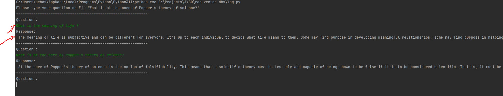
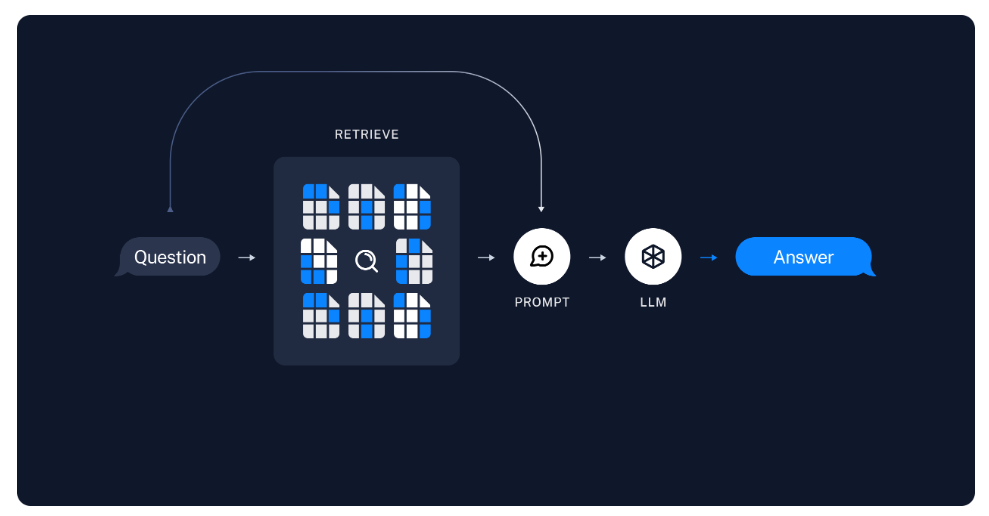
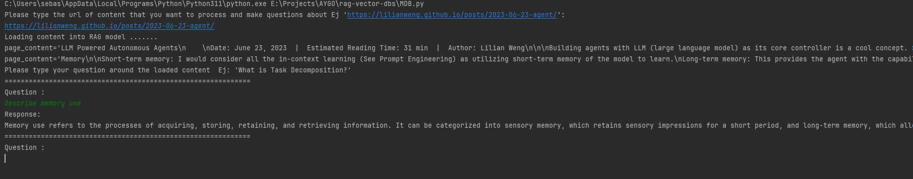
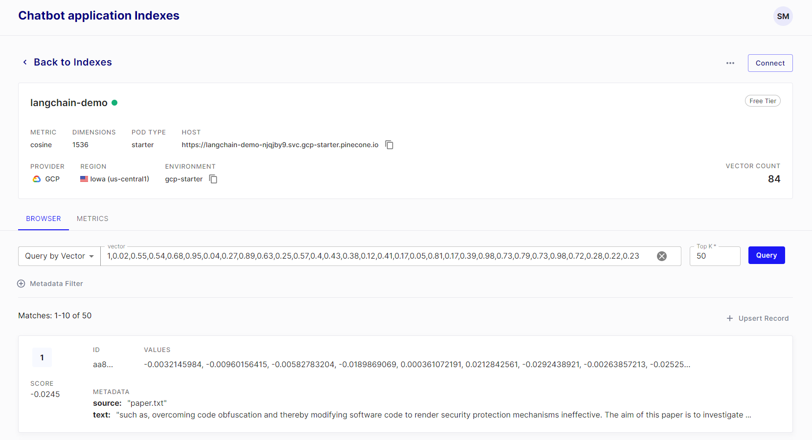
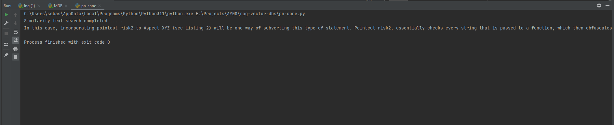

# RETRIEVAL-AUGMENTED GENERATION (RAG) AND VECTOR DATABASES
## Resumen
Este repositorio contiene el detalle del desarrollo de los ejercicios orientados al entendimiento del modelo RAG

## Detalles técnicos del proyecto
- [python3.11](https://www.python.org/downloads/release/python-3110/)
- [langchain](https://www.langchain.com/)
- [OpenAI](https://openai.com/)
- [BS4](https://pypi.org/project/beautifulsoup4/)
- [chromadb](https://www.trychroma.com/)

## Features 
- Cuatro experimentos que demuestran las capacidades básicas de soluciones basadas en IA que usan el modelo RAG

## Instalación

Ejecute el siguiente comando para instalar todas las dependencias requeridas para la solución.  
```bash
pip install 
```
Opcionalmente puede instalar las dependencias con sus comandos de manera independiente siguiendo: 
```bash
pip install langchain
pip install OpenAI
pip install bs4
pip install chromadb
pip install langchainhub
pip install pinecone-client openai tiktoken langchain
```


## Configuración
Para la ejecución de esta demo el interesado deberá modificar el archivo .env con las credenciales de API (De pago) necesarias. 

Para mas información sobre cómo generar la API Key de openAI, puede usar la siguiente guia [Guide](https://www.maisieai.com/help/how-to-get-an-openai-api-key-for-chatgpt).

Asi mismo necesitará una API Key de [PineCone](https://docs.pinecone.io/docs/quickstart). 

```env
OPENAI_API_KEY=<OpenAI key>
PINECONE_API_KEY=<PineCone key>
PINECONE_ENV=gcp-starter
FILE_NAME=paper.txt
```

## Experimento #1 
En este experimento se demuestran las capacidades básicas de uso del API en python sobre LLM(Large language models), en este caso se usará OpenAI cómo LLM de demostración. 


### Ejecución de la solución en entorno local 
```bash
python lng.py
```
La solución creará una conexión con los servicios del LLM con una plantilla de Prompt 

```python
prompt = PromptTemplate(template=template, input_variables=["question"])
llm = OpenAI()
llm_chain = LLMChain(prompt=prompt, llm=llm)
```

El experimento esperará al prompt del usuario por consola y mostrará la respuesta correspondiente, en un ciclo infinito de pregunta-respuesta. 




## Experimento #2
El segundo experimento proveerá un contexto al LLM, usando el motor "gpt-3.5-turbo".

El contexto en el proceso de RAG conocido cómo indexación, será una URL que será dividida en pequeñas piezas y generará un modelo por similaridad.

Luego el LLM contestará al prompt basado en el contexto proporcionado.


### Ejecución de la solución en entorno local 
```bash
python MDB.py
```
La solución cargará la página web así, usando cómo identificadores los tags "post-content", "post-title" y "post-header". 

```python
loader = WebBaseLoader(
        web_paths=(content_url,),
        bs_kwargs=dict(
            parse_only=bs4.SoupStrainer(
                class_=("post-content", "post-title", "post-header")
            )
        ),
    )
    docs = loader.load()
```

luego dividirá el contexto así 

```python
text_splitter = RecursiveCharacterTextSplitter(chunk_size=1000, chunk_overlap=200)
splits = text_splitter.split_documents(docs)
print(splits[0])
print(splits[1])

vectorstore = Chroma.from_documents(documents=splits, embedding=OpenAIEmbeddings())
retriever = vectorstore.as_retriever()
```

El prompt provider será generado así  

```python
    prompt = hub.pull("rlm/rag-prompt")
    llm = ChatOpenAI(model_name="gpt-3.5-turbo", temperature=0)

    rag_chain = (
            {"context": retriever | format_docs, "question": RunnablePassthrough()}
            | prompt
            | llm
            | StrOutputParser()
    )
```



El experimento esperará al prompt del usuario por consola y mostrará la respuesta correspondiente, en un ciclo infinito de pregunta-respuesta con la limitación del contexto proporcionado. 




## Experimento #3
El segundo experimento mostrará las capacidades para cargar un documento, usando el modelo RAG  


El documento será una tesis que encontrará en formato TXT en este repo paper.txt

### Ejecución de la solución en entorno local 
```bash
python pn-cone.py
```
La solución cargará el documento así 

```python
loader = TextLoader(os.getenv('FILE_NAME'))
documents = loader.load()
```

luego dividirá el contexto así 

```python
text_splitter = RecursiveCharacterTextSplitter(
        chunk_size = 1000,
        chunk_overlap  = 200,
        length_function = len,
        is_separator_regex = False,
    )


docs = text_splitter.split_documents(documents)

embeddings = OpenAIEmbeddings()
```
Luego cargará el modelo procesado al servicio de PineCone asi
```python
    pinecone.init(
        api_key=os.getenv("PINECONE_API_KEY"),  # find at app.pinecone.io
        environment=os.getenv("PINECONE_ENV"),  # next to api key in console
    )

    index_name = "langchain-demo"

    # First, check if our index already exists. If it doesn't, we create it
    if index_name not in pinecone.list_indexes():
        # we create a new index
        pinecone.create_index(name=index_name, metric="cosine", dimension=1536)
    # The OpenAI embedding model `text-embedding-ada-002 uses 1536 dimensions`
    docsearch = Pinecone.from_documents(docs, embeddings, index_name=index_name)
```

El prompt será definido así, el query para pruebas será "distributed pointcut". 

```python
    # initialize pinecone
    pinecone.init(
        api_key=os.getenv("PINECONE_API_KEY"),  # find at app.pinecone.io
        environment=os.getenv("PINECONE_ENV"),  # next to api key in console
    )

    index_name = "langchain-demo"
    # if you already have an index, you can load it like this
    docsearch = Pinecone.from_existing_index(index_name, embeddings)

    query = "distributed pointcut"
    docs = docsearch.similarity_search(query)
```







